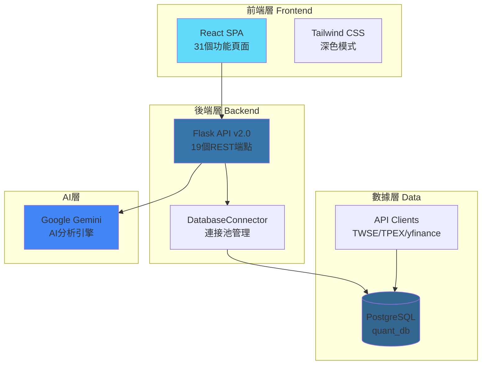

# 🚀 AI投資分析儀 (AI Investment Analyzer)

**基於量化因子與AI驅動的智能投資決策系統**

[](LICENSE)
[](https://www.python.org/)
[](https://reactjs.org/)
[](https://www.postgresql.org/)

> 整合台股、美股、總經數據與Google Gemini AI的全方位投資分析平台

---

## ✨ 系統特色

- 🎯 **六大因子量化分析** - 價值、品質、動能、規模、波動、成長
- 📊 **20+ 技術指標** - MA, EMA, MACD, RSI, KD, 布林通道, ATR 等
- 🤖 **Gemini AI 整合** - 每日戰略報告、決策模板自動生成
- 📈 **TDCC 大戶同步率** - 集保中心權威籌碼資料
- 💼 **投資組合優化** - 效率前緣、蒙地卡羅模擬
- 🔬 **策略回測實驗室** - No-Code 策略建構、完整績效分析
- 🎨 **現代化介面** - React + Tailwind CSS + Dark Mode
- 🔄 **API金鑰同步** - 前後端自動同步管理

---

## 🚀 快速開始

### 環境需求

- Node.js >= 18.0.0
- Python >= 3.13.0
- Docker & Docker Compose

### 啟動所有服務

**方法一：一鍵啟動腳本（推薦）**

```bash
# Windows
start_all.bat

# 跨平台（Python）
python startup_manager.py start
```

**方法二：手動啟動**

```bash
# 1. 啟動資料庫
docker-compose up -d

# 2. 啟動後端API（新版v2.0）
python api_server_v2.py
# http://localhost:5000

# 3. 啟動前端
cd frontend
npm install
npm run dev
# http://localhost:5173
```

### 配置環境變數

編輯 `config/.env`：

```bash
# 資料庫配置
DB_HOST=localhost
DB_PORT=15432
DB_NAME=quant_db
DB_USER=postgres
DB_PASSWORD=postgres

# API金鑰（請填入你的金鑰）
GEMINI_API_KEY=your_gemini_key
ALPHA_VANTAGE_API_KEY=your_alpha_key
FRED_API_KEY=your_fred_key
```

---

## 🏗️ 系統架構



---

## 📊 完整功能清單

### 前端頁面（31個）✅

**基礎頁面（8個）**
1. ✅ Dashboard - 市場總覽 + AI觀點
2. ✅ ShareholderAnalysis - TDCC大戶同步率
3. ✅ FactorDashboard - 六大因子雷達圖
4. ✅ AIInsights - 每日報告展示
5. ✅ TechnicalAnalysis - 價格圖表 + 技術指標
6. ✅ PortfolioManagement - 持股明細 + 風險指標
7. ✅ NewsManagement - RSS訂閱 + AI摘要
8. ✅ Settings - 系統設定 + API金鑰管理

**進階決策頁面（11個）**
9. ✅ PortfolioOptimization - 投資組合優化
10. ✅ StrategyBacktesting - 策略回測
11. ✅ PortfolioStressTesting - 壓力測試
12. ✅ InvestmentGoals - 投資目標追蹤
13. ✅ AIChatAnalyst - 對話式AI分析師
14. ✅ SimilarAssetsFinder - 相似資產發現器
15. ✅ SmartAlertSystem - 智慧事件警報
16. ✅ DynamicIntelligence - 動態情報儀表板
17. ✅ AIPortfolioStrategy - AI投資組合策略
18. ✅ WhatIfSimulator - 假設情境模擬器
19. ✅ BehavioralCoach - 行為金融教練

**管理工具頁面（12個）**
20-31. ✅ PortfolioDetails, TransactionLog, AccountManagement等

### 後端API（19個端點）✅

**健康檢查** - `GET /api/health`  
**API配置** - `GET /api/config/api-keys`, `POST /api/config/sync-api-keys`  
**資料庫** - `GET /api/database/tables`, `GET /api/database/table/<name>`  
**股票資訊** - `GET /api/stocks/list`, `GET /api/stocks/search`, `GET /api/stocks/<code>`  
**價格資料** - `GET /api/prices/<code>`, `GET /api/prices/<code>/latest`  
**因子分數** - `GET /api/factors/<code>`, `GET /api/factors/<code>/history`  
**TDCC數據** - `GET /api/tdcc/<code>`  
**技術指標** - `GET /api/indicators/<code>`  
**AI報告** - `GET /api/ai/reports`, `GET /api/ai/report/<id>`  
**投資組合** - `GET /api/portfolio/list`, `GET /api/portfolio/<id>/holdings`

---

## 🎯 核心功能演示

### API使用範例

```bash
# 1. 檢查系統狀態
curl http://localhost:5000/api/health

# 2. 搜尋股票
curl "http://localhost:5000/api/stocks/search?q=台積電&market=tw"

# 3. 獲取因子分數
curl "http://localhost:5000/api/factors/2330?market=tw"

# 4. 查詢股價資料
curl "http://localhost:5000/api/prices/2330?market=tw&days=30"
```

### Python使用範例

```python
import requests

# 獲取股票清單
response = requests.get('http://localhost:5000/api/stocks/list', 
                       params={'market': 'tw', 'limit': 20})
stocks = response.json()['stocks']

# 獲取因子分數
response = requests.get('http://localhost:5000/api/factors/2330',
                       params={'market': 'tw'})
factors = response.json()
print(f"價值分數: {factors['value_score']}")
```

---

## 📈 技術棧

### 前端
- React 18.3 + Vite 5.4
- Tailwind CSS 3.4
- Recharts 2.15
- React Router 7.0
- Lucide React (圖標)

### 後端
- Python 3.13
- Flask 3.0 (Web框架)
- PostgreSQL 15 (資料庫)
- psycopg2 (資料庫驅動)
- pandas + NumPy (數據處理)
- loguru (日誌記錄)

### 數據來源
- **台股** - TWSE OpenAPI, TPEX API, TDCC
- **美股** - yfinance, Alpha Vantage, Finnhub
- **總經** - FRED API (聯準會經濟數據)
- **黃金** - GoldAPI
- **匯率** - ExchangeRate API
- **AI** - Google Gemini 2.0

---

## 🎨 介面預覽

系統包含：
- 📊 15+ Recharts 互動圖表
- 🌓 完整 Dark Mode 支援
- 📱 響應式設計
- 🎯 直覺導航與快速操作

---

## 📁 專案結構

```
AI-Investment-Analyzer/
├── frontend/                 # React前端應用
│   ├── src/
│   │   ├── pages/           # 31個功能頁面
│   │   ├── components/      # 可複用組件
│   │   └── App.jsx
│   └── package.json
│
├── api_server_v2.py         # ✨ API伺服器v2.0（601行）
├── data_loader/             # 數據載入模組
│   ├── database_connector.py  # ✨ 新增（連接池）
│   └── database_writer.py
│
├── calculators/             # 因子計算器
│   ├── value_factor.py
│   ├── quality_factor.py
│   └── ...
│
├── api_clients/             # API客戶端
│   ├── tw_stock_client.py
│   └── us_stock_client.py
│
├── config/
│   └── .env                 # 環境變數配置
│
├── docker-compose.yml       # Docker配置
└── requirements.txt         # Python依賴
```

---

## 🆕 最新更新（v2.0）

### 2025-11-25
- ✅ **API伺服器v2.0** - 全新實現，整合DatabaseConnector
- ✅ **19個API端點** - 完整的REST API實現
- ✅ **連接池管理** - 提升資料庫性能與穩定性
- ✅ **前後端API同步** - Settings頁面自動同步API金鑰
- ✅ **完整錯誤處理** - 統一的錯誤回應格式
- ✅ **日誌記錄** - 使用loguru記錄所有操作

### 2025-11-24
- ✅ GitHub代碼上傳
- ✅ 深色模式雙向同步修復

### 2025-11-23
- ✅ 前端31個頁面全部完成

---

## ❓ 常見問題

**Q: 如何獲取API金鑰？**

A: 請訪問以下網址申請：
- Google Gemini: https://aistudio.google.com/app/apikey
- Alpha Vantage: https://www.alphavantage.co/support/#api-key
- FRED: https://fred.stlouisfed.org/docs/api/api_key.html

**Q: 資料庫連接失敗怎麼辦？**

A: 確認：
1. Docker容器運行：`docker ps`
2. 密碼設置為`postgres`（config/.env）
3. Port 15432未被占用

**Q: 如何填充歷史數據？**

A: 執行數據回溯腳本（開發中）

---

## 📊 開發進度

- ✅ 前端31個頁面完成（100%）
- ✅ API伺服器v2.0完成（100%）
- ✅ DatabaseConnector實現（100%）
- ✅ 基礎功能就緒（100%）
- ⏳ 數據回溯（進行中）
- ⏳ AI功能優化（進行中）

**總體完成度：約80%**

---

## 👥 作者

**JUDRAGONII**
- GitHub: [@JUDRAGONII](https://github.com/JUDRAGONII)
- Email: JUDRAGONII@gmail.com

---

## 📝 授權

本專案為私人開發專案。

---

## 🙏 致謝

- Google Gemini - AI分析引擎
- TWSE/TPEX - 台股數據來源
- yfinance - 美股數據
- React - 前端框架
- Flask - 後端框架
- PostgreSQL - 資料庫

---

<div align="center">

**⭐ 給個星星支持一下！⭐**

**最後更新**: 2025-11-25

Made with ❤️ by JUDRAGONII

</div>
